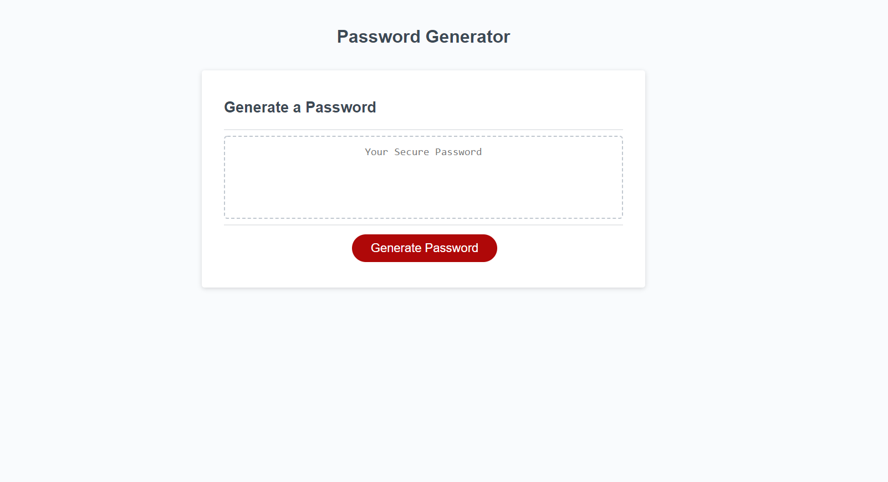

## Password Generator Starter Code

### Description
For this challenge, we were tasked with completeyting the code for a Password Generator. The User enters a desired password length between 8 and 128 characters and then generate a password based on a series of confirmations that will determine wether to include special characters, numbers, and upper/lowercase letters. This was accomplished through a series of if and else if statements, combined with for loops that generated the password from a string with the entered parameters.

### Website Screenshot

#### Link to Live Site: 
https://logandufek.github.io/ChallengeThreePasswordGenerator/